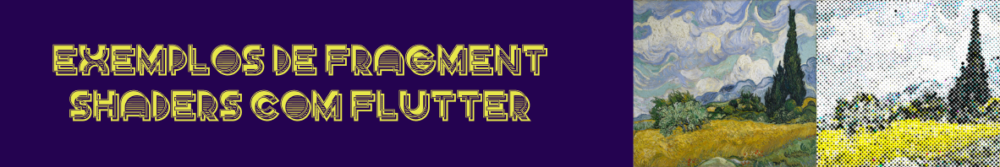

De acordo com o livro [thebookofshaders](https://thebookofshaders.com/), <b>fragment shaders</b> são um conjunto de instruções executadas ao mesmo tempo para cada pixel na tela, recebendo sua posição e realizando modificações de cor e adicionando efeitos como sombreamento, textura e transparência, comportando-se de maneira diferente de acordo com a posição do respectivo pixel.

A implementação de shaders requer o uso de linguagens específicas como o <b>GLSL (OpenGL Shading Language)</b> ou o <b>HLSL (High-Level Shading Language)</b>. Essas linguagens permitem que o código seja executado na GPU, aproveitando o poder de processamento paralelo.

Devido ao controle total sobre os pixels renderizados na tela e sua execução na GPU, a velocidade de processamento é muito rápida e os efeitos gráficos gerados são surpreendentes, sendo utilizados para a mais diversas finalidades, como filtros de videos e jogos.

As engines gráficas disponíveis atualmente para o Flutter, como o <b>Skia</b> e o <b>Impeller</b>, suportam a implementação de shaders, gerando efeitos que vão além dos fornecidos pelo SDK. Maiores detalhes em  [flutter fragment shaders](https://docs.flutter.dev/ui/design/graphics/fragment-shaders).

Esse repositório tem como objetivo implementar os exemplos de shaders do livro <b>thebookofshaders</b>, usando o Flutter e a linguagem GLSL, tendo seus resultados exibidos através de dispositivos Android e iOS.

## Tecnologias/bibliotecas

As tecnologias/bibliotecas utilizadas na construção foram:

  <table>
    <tr><th>Toolkit </th><th>Produção </th><th>Desenvolvimento</th></tr>
    <tr><td>

|| Versão|
|:------------:|:--|
|**flutter**| 3.29.0 |
|**dart**| 3.7.0 |

</td><td>

|Biblioteca| Versão|
|:------------:|:--|
|**flutter_shaders**| ^0.1.3 |

  </td><td>

|Biblioteca| Versão|
|:------------:|:--|
|**flutter_lints**| ^5.0.0 |
|**custom_lint**| ^0.7.0 |
|**pyramid_lint**| ^2.0.2 |

  </td></tr>
  </table>

## O projeto

Para a reprodução e visualização dos exemplos disponíveis no livro <b>thebookofshaders</b>, foi criado um aplicativo em Flutter com a listagem de cada exemplo, separandos-os de acordo com os capítulos disponíveis.

Os códigos foram todos reproduzidos levando em consideração a particularidades de implementação necessárias para o Flutter, como o uso da biblioteca <b>flutter/runtime_effect.glsl</b>, além de seguir algumas normas mais comumentes utilizadas, como, por exemplo, os nomes das variáveis de entrada e saída.

Além disso os códigos não foram simplesmente copiados e colados. Todos passaram por um processo de refatoração com a finalidade de melhor compreensão do seu funcionamento.

Por exemplo, comentários no código foram transformados em nomes de variáveis e até mesmo de funções, nesse caso permitindo o isolamento do respectivo fragmento de código para melhor entendimento de seu contexto. O próprio texto do livro, explicando algum pedaço de código importante também foi usado no mecanismo de refatoração.

#### Lista de capítulos / exemplos

  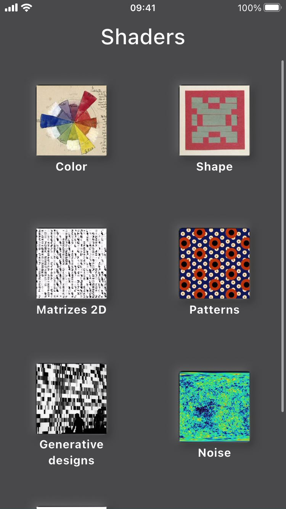
  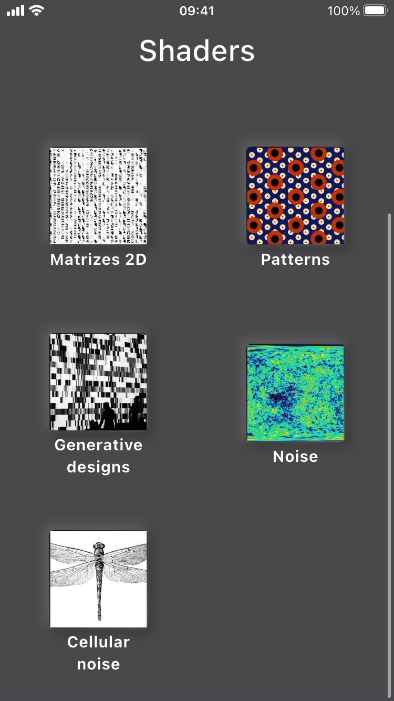
  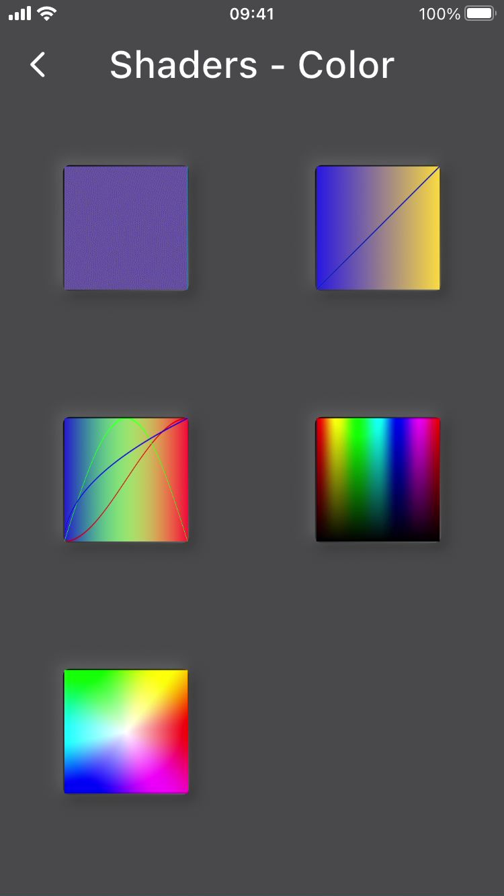
  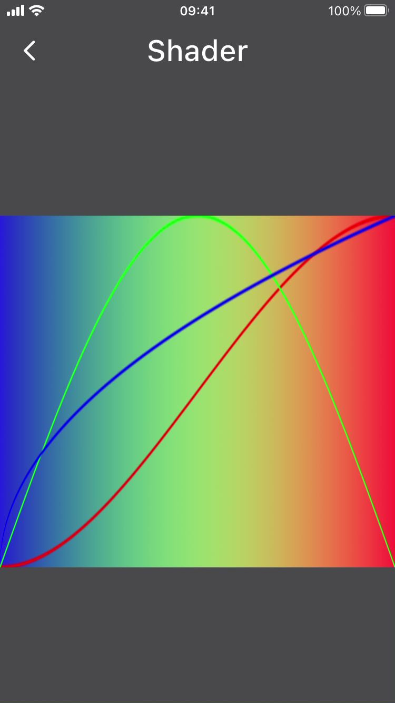
  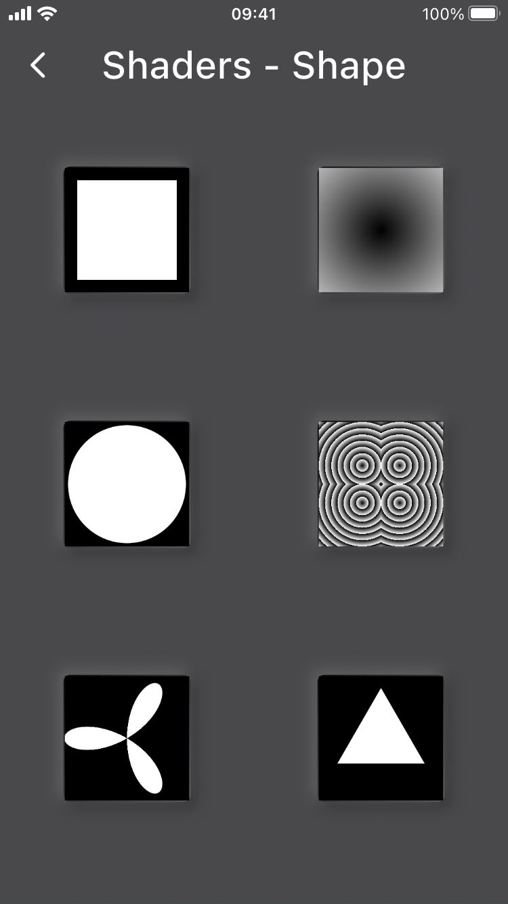
  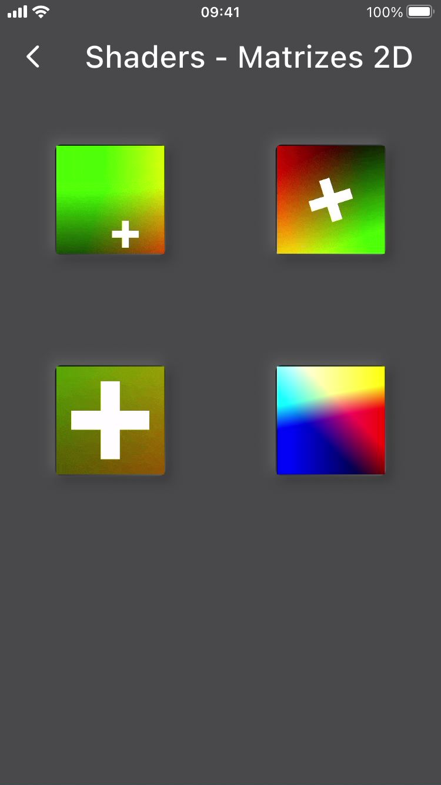
  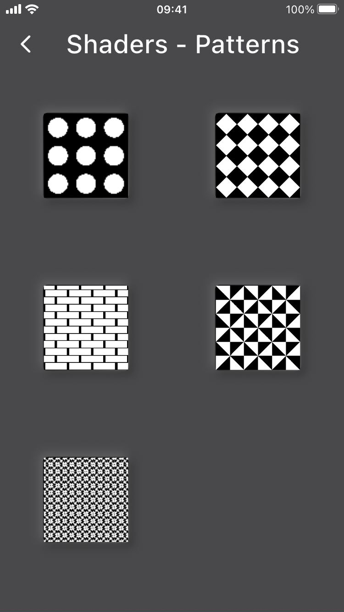
  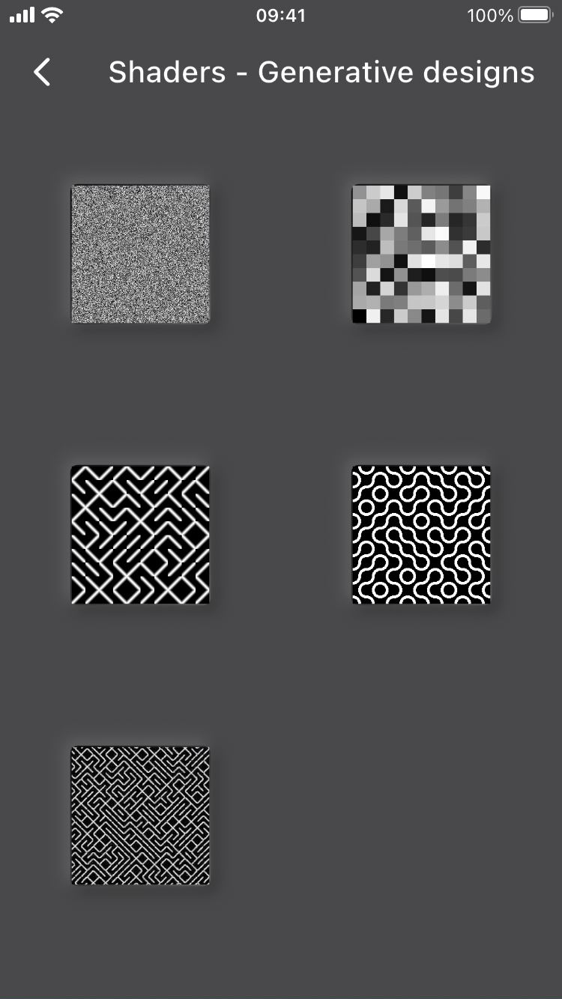
  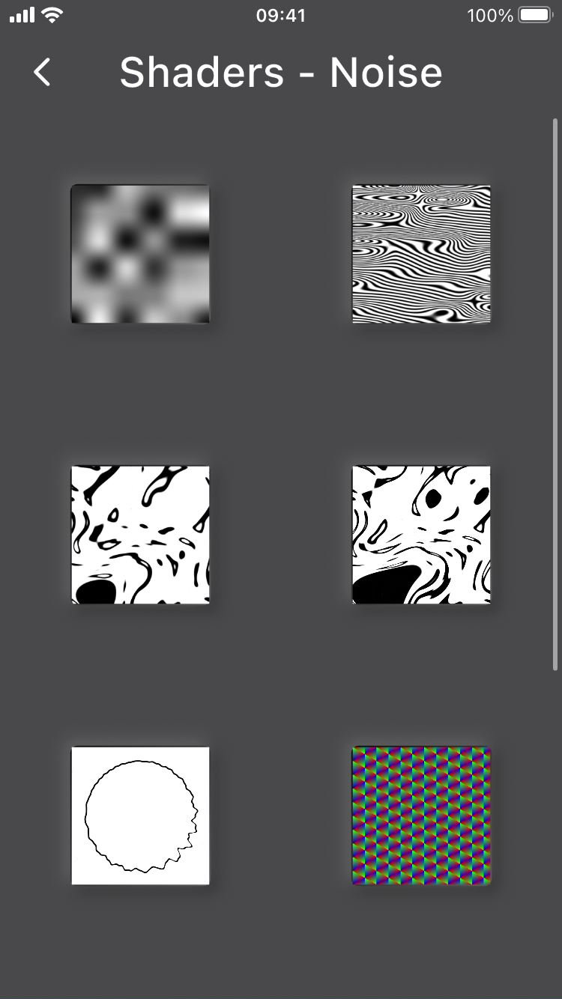
  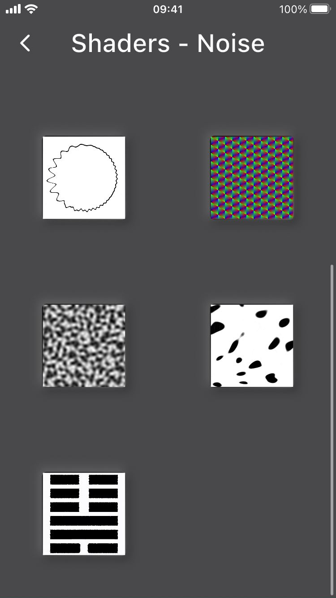
  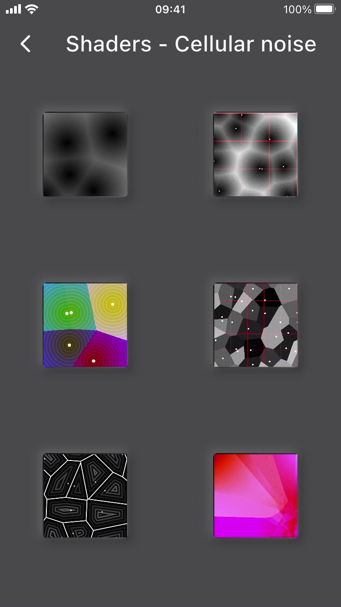

#### Exemplo de execução em dispositivos Android e iOS

<table>
  <tr>
    <td>
      

        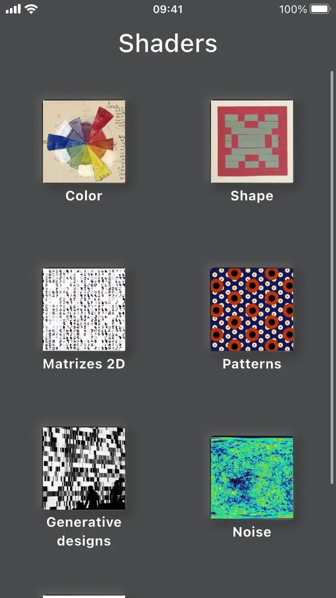
      

      

        iPhone 7 (iOS 15.8.3)
      

    </td>
    <td>
      

        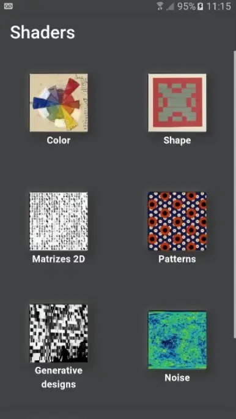
      

      

        Samsung Galaxy J5 (Android 6.0.1)
      

    </td>
  </tr>
  <tr>
    <td>
      

        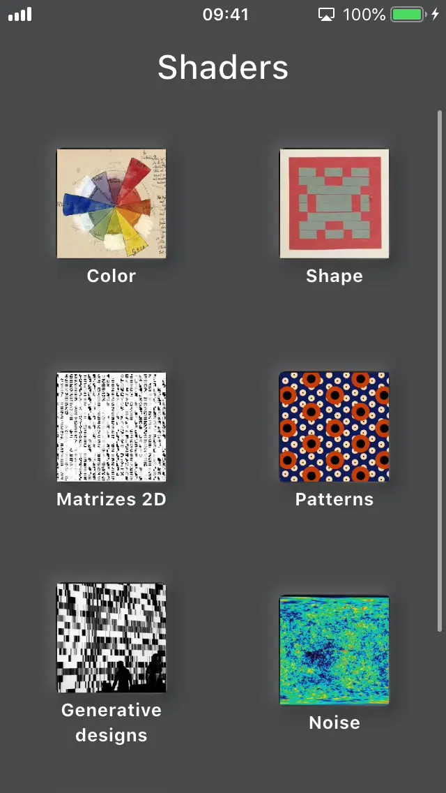
      

      

        iPhone 5 (iOS 12.5.7)
      

    </td>
  </tr>
</table>

## Assets

[shader font](https://www.dafont.com/pt/shader.font)
